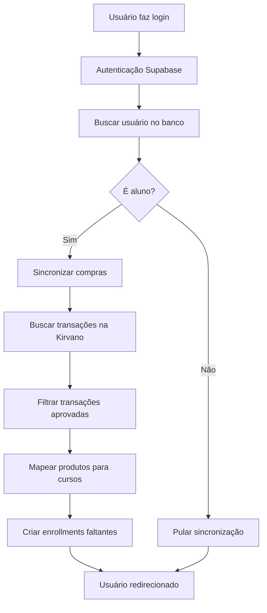

# Sincronização Automática de Compras

Sistema que verifica automaticamente se um usuário comprou novos cursos e libera o acesso automaticamente.

## Como Funciona

### 1. Sincronização no Login
Toda vez que um aluno faz login, o sistema:
- Busca todas as transações aprovadas do usuário na Kirvano
- Verifica quais produtos foram comprados
- Mapeia produtos para cursos
- Cria enrollments (matrículas) automaticamente para cursos que o usuário ainda não tem acesso

### 2. Via Webhook (Imediato)
Quando uma compra é processada na Kirvano, o webhook já libera o acesso imediatamente.

### 3. Sincronização Manual
Também é possível sincronizar manualmente através da rota API `/api/sync-purchases`.

## Configuração

### Passo 1: Configurar API Key da Kirvano

1. Acesse o painel admin da plataforma
2. Vá em **Webhooks/Integrações**
3. Edite a integração Kirvano
4. Adicione sua API Key da Kirvano no campo de configuração

**Formato do config:**
```json
{
  "apiKey": "sua-api-key-aqui"
}
```

### Passo 2: Vincular Produtos aos Cursos

1. Acesse **Produtos** no painel admin
2. Para cada produto Kirvano, vincule aos cursos correspondentes
3. Certifique-se de que o `externalProductId` corresponde ao ID do produto na Kirvano

## Fluxo de Sincronização



## Logs

O sistema gera logs detalhados no console para debug:

```
[syncUserPurchases] Iniciando sincronização para usuário xxx
[syncUserPurchases] 5 transações encontradas
[syncUserPurchases] 3 transações aprovadas
[syncUserPurchases] 2 mapeamentos de produtos encontrados
[syncUserPurchases] ✅ Novo enrollment criado: Nome do Curso
[syncUserPurchases] Sincronização concluída. 1 novos cursos liberados
```

## API de Sincronização Manual

### Endpoint
```
POST /api/sync-purchases
```

### Autenticação
Requer usuário autenticado (cookie de sessão).

### Resposta

**Sucesso:**
```json
{
  "success": true,
  "newEnrollments": 2,
  "message": "2 novo(s) curso(s) liberado(s)!"
}
```

**Sem novos cursos:**
```json
{
  "success": true,
  "newEnrollments": 0,
  "message": "Nenhum curso novo encontrado"
}
```

**Erro:**
```json
{
  "success": false,
  "message": "Erro ao sincronizar compras"
}
```

## Status das Transações

O sistema considera as seguintes transações como aprovadas:
- `approved`
- `paid`
- `complete`

## Importante

⚠️ **A sincronização não bloqueia o login do usuário**. Ela é executada de forma assíncrona em segundo plano.

⚠️ **Certifique-se de ter configurado a API Key da Kirvano** antes de usar a sincronização.

⚠️ **O webhook da Kirvano continua sendo a forma principal** de liberar acessos. A sincronização no login é uma verificação adicional de segurança.
